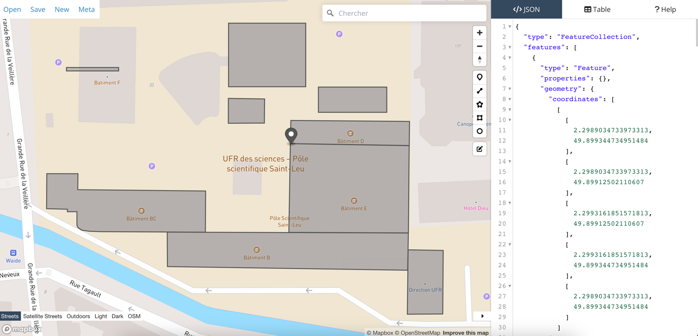

# centermap

### Prérequis
- Installer nodeJS sur son ordinateur : https://nodejs.org/en/
***
### Installation du projet
- Télécharger le repository
```
git clone https://github.com/RemsGIT/Center-Map.git
```

- Installer les dépendances du projet

```
npm install
```
***
### Lancement du projet en local 
```
npm run serve
```
***
### Ajouter/modifier un point sur la carte
- Prendre le contenu de du fichier data/geojson/geojson.js et le coller sur : 


- Faire les modifications puis copier/coller le nouveau geojson à droite dans le fichier (vérifier sur
l'application si les changements sont corrects)

#### Modifier les informations d'un point

- Ajouter les données dans l'objet "properties" :
- Types de bâtiment : 
  - **upjvBuilding** : bâtiments UPJV
  - **upjvBU** : bibliothèques universitaires
  - **upjvRU** : restaurants universitaires
  - **crous** : CROUS

<!-- --> 
- BÂTIMENTS UPJV
```js
"properties": {
    type: 'upjvBuilding',
    name: 'UFR des sciences - bâtiment D',
    lat: '49.898948685098155',
    lng: '2.299693822860718',
    icon: 'upjvBuildingIcon.png',
    rooms: [],
    amphitheaters: [
      {name: '', seats: 100},
      {name: '', seats: 90},
    ],
    image: '',
    gStreetViewLink: ''
}
```
- BIBLIOTHÈQUES UNIVERSITAIRES
```js
"properties": {
  type: 'upjvBU',
  name: 'Bibliothèque universitaire - Cathédrale',
  lat: '49.896376053567735',
  lng: '2.3010349273681645',
  icon: 'upjvBuIcon.png',
  subjects: ['Sciences et technologie', 'Droit', 'Économie', 'Gestion', 'Science politique'],
  address: '15 Placette Lafleur, Amiens',
  image: '',
  gStreetViewLink: 'https://www.google.com/maps/embed?pb=!4v1672735378786!6m8!1m7!1s_OfSCOJY6cdEc3e2gc_d8g!2m2!1d49.89636454134919!2d2.301485488341018!3f231.2695643022339!4f6.020811561334483!5f0.7820865974627469'
},

```

***

